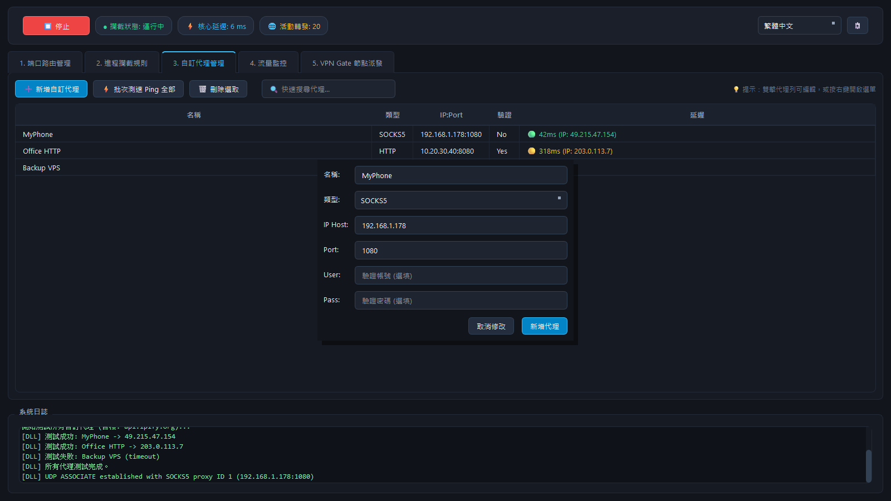
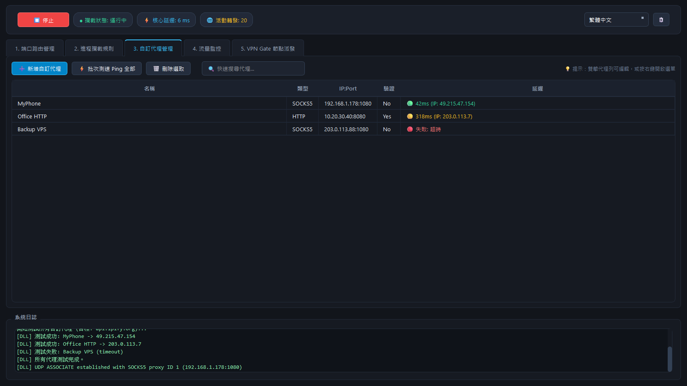
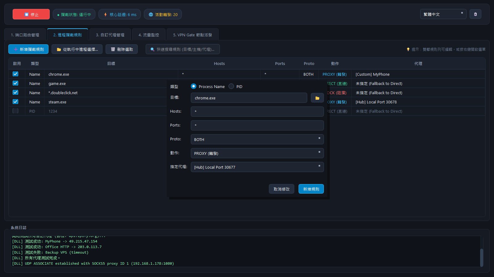
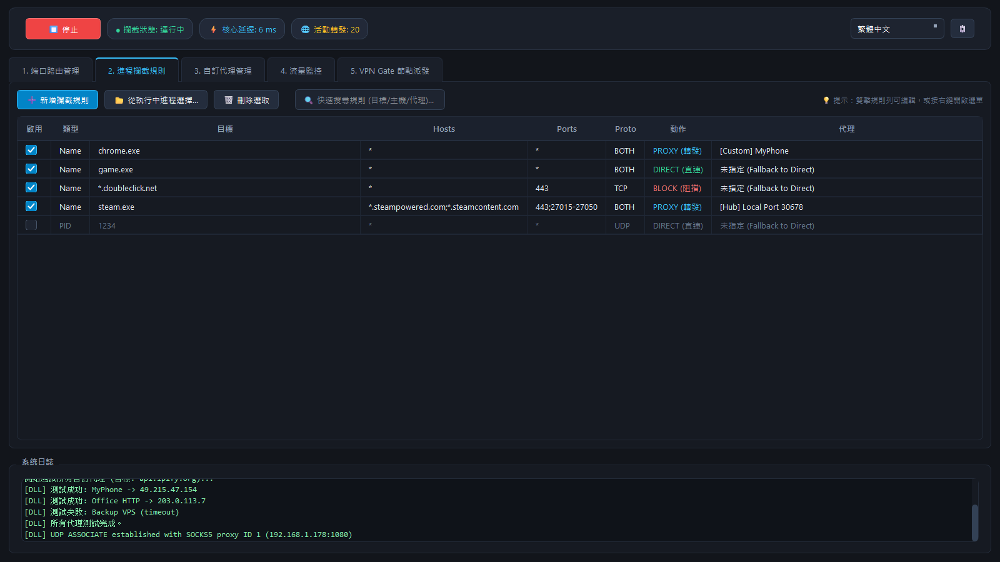
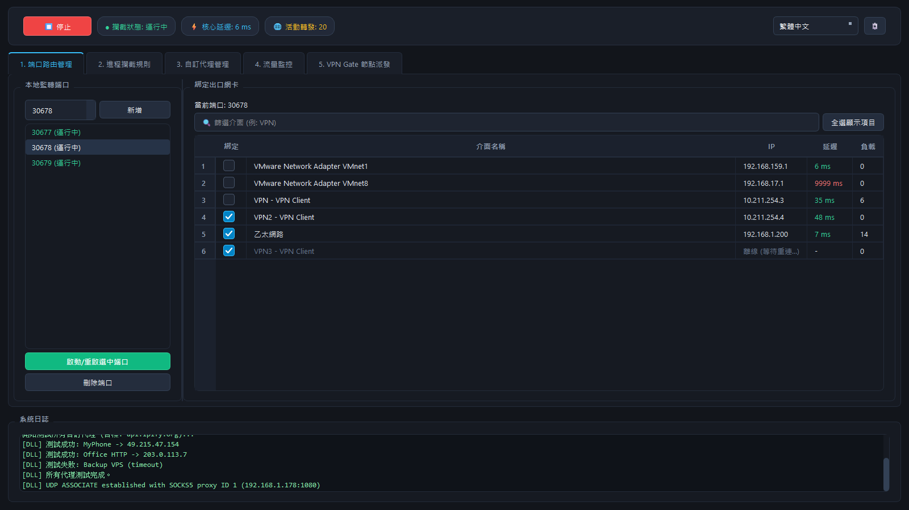
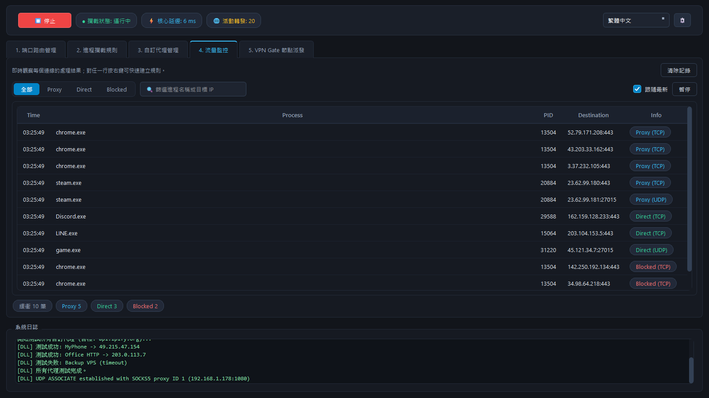

# NetRedirector 完整圖文操作教學（結合 5G Proxy Pro）

> 本教學說明如何透過 **NetRedirector** (Windows) 連接到手機端的 **5G Proxy Pro**，讓電腦流量經由手機 5G 網路對外上網。
> 環境需求：Windows 10/11（需管理員權限）、手機已安裝 5G Proxy Pro 並連至同一 Wi-Fi。

---

## 1. 名詞與架構

| 角色 | 設備 | 軟體 | 說明 |
|---|---|---|---|
| **Server 端** | 手機 | 5G Proxy Pro | 將 5G 網路轉為 SOCKS5 代理（監聽於 Wi-Fi 內網） |
| **Client 端** | Windows 電腦 | NetRedirector | 攔截本機流量並轉發至手機代理 |

> **⚠️ 重要提醒：**
> 手機端顯示的 `192.168.1.178:35577` 是 **遠端 ADB 控制埠**，**不是代理埠**！
> 請務必以 App 介面上標示的「**Wi-Fi 代理**」IP 與 Port（預設 **1080**）為準。

### 流量路徑 (Architecture)

```text
[Windows 本機 App] --WinDivert 攔截--> [NetRedirector 規則] --SOCKS5 (Wi-Fi)--> [手機 5G Proxy Pro (192.168.1.178:1080)] --5G 介面--> [Internet]
```

---

## 2. 步驟 0：前置準備

1. **網路環境**：手機與電腦必須連線至**同一個 Wi-Fi 路由器**（確保內網互通）。
2. **手機端**：插好 SIM 卡並確認有 5G/4G 訊號。
3. **電腦端**：NetRedirector 涉及驅動層攔截，請務必以 **「系統管理員身分」** 啟動軟體（例如執行 `python IntegratedApp.py`）。

---

## 3. 步驟 1：手機端啟動 5G Proxy Pro

1. 開啟手機上的 **5G Proxy Pro** App。
2. 點擊 **「🚀 一鍵開啟 5G 代理」**。
3. 啟動成功後，畫面會顯示：
   - **📶 Wi-Fi 代理**：`192.168.1.178:1080` ← **請記下此位址**。
   - **📲 5G 行動 IP**：`49.215.85.39` ← 驗證基準（若成功，電腦出口 IP 應與此一致）。

---

## 4. 步驟 2：NetRedirector 設定

### 4.1 自訂代理管理 (Proxies)
在「3. 自訂代理管理」分頁新增手機端提供的代理資訊。



| 欄位 | 填入內容 | 說明 |
|---|---|---|
| **代理名稱** | `MyPhone` | 自訂名稱，方便規則引用 |
| **代理類型** | `SOCKS5` | 手機端提供的協定 |
| **IP Host** | `192.168.1.178` | 手機的 Wi-Fi 內網 IP |
| **Port** | `1080` | 手機端顯示的代理埠 (預設 1080) |
| **User/Pass** | (留空) | 若手機端無設定帳密則不填 |


> 新增後可點擊 **「測試所有代理連線 (Ping)」** 確認電腦是否能連通手機。

### 4.2 進程攔截規則 (Rules)
在「2. 進程攔截規則」分頁設定哪些流量需要經過手機 5G。


- **Process Name**: 若要攔截全部流量可設為 `*`，或填入特定程序名（如 `chrome.exe`）。
- **動作**: 選擇 **`PROXY (轉發)`**。
- **指定代理**: 選擇剛才建立的 **`[Custom] MyPhone`**。


> 點擊「新增攔截規則」後，規則會出現在下方表格。

### 4.3 端口路由管理 (Hub)
在「1. 端口路由管理」分頁確認本地監聽與網卡綁定。


> 確認監聽端口（如 `30678`）已開啟，且右側已選中要輸出的網路介面（如：乙太網路、VPN 網卡等）。

---

## 5. 步驟 3：啟動與監控

### 5.1 啟動服務
點擊主視窗頂部的 **「啟動攔截服務 (Start Redirector)」**。


> 狀態顯示為 **「運行中」** 時，攔截驅動正式生效。若要變更設定，請先點擊 **「停止」**。

### 5.2 流量監控 (Monitor)
切換至「4. 流量監控」分頁觀察即時連線。


> 這裡會顯示每個進程的連線目標與轉發路徑，確認 Destination 確實有導向手機代理。

---

## 6. 步驟 4：驗證出口 IP

開啟 Windows 命令提示字元 (CMD) 或 PowerShell，執行以下指令：

```powershell
curl.exe --proxy socks5h://192.168.1.178:1080 https://api.ipify.org
```

**預期結果：**
- 應回傳 `49.215.85.39`。
- 此 IP 應與手機端顯示的 **「5G 行動 IP」** 完全一致，證明流量已成功經由手機 5G 網卡對外。

---

## 7. 常見問題 (FAQ)

| 症狀 | 可能原因 | 解決方法 |
|---|---|---|
| SOCKS5 握手無回應 | 填到了 **ADB 控制埠** | 確認 Port 為 `1080` (App 顯示的 Wi-Fi 代理埠)，而非 35577 等。 |
| 驅動啟動失敗 (WinDivert) | 權限不足或安全軟體阻擋 | 請以「系統管理員身分」執行；暫時關閉防毒軟體再試。 |
| 5G 出口 IP 不符 | 規則動作設為 `DIRECT` | 確認規則分頁中，該規則的「動作」確實為 `PROXY` 並選中 `MyPhone`。 |
| 手機 IP 突然失效 | Wi-Fi 租約過期導致 IP 變動 | 重新查看手機 App 顯示的 Wi-Fi 代理 IP，並更新 NetRedirector 代理設定。 |

---

## 8. 附錄：圖檔對照表

| 檔案路徑 | 對應功能分頁 | 畫面重點 |
|---|---|---|
| `docs/images/1.png` | 1. Hub | 本地監聽埠列表、網卡綁定 (30678) |
| `docs/images/2-1.png` | 2. Rules | 新增規則表單 (Process/Action/Proxy) |
| `docs/images/2-2.png` | 2. Rules | 已啟用的攔截規則列表 |
| `docs/images/3-1.png` | 3. Proxies | 新增外部 SOCKS5 代理表單 |
| `docs/images/3-2.png` | 3. Proxies | 代理伺服器列表與 Ping 測試 |
| `docs/images/4.png` | 4. Monitor | 即時流量與連線記錄 (Time/Dest) |
| `docs/images/start.png` | 頂部控制列 | 啟動成功，狀態變更為「運行中」 |
| `docs/images/stop.png` | 頂部控制列 | 停止服務，驅動解除攔截 |
